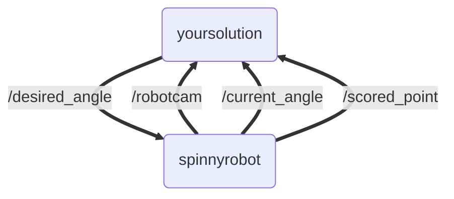

# TR-Autonomy-2
Second Training Module for TR Autonomy Recruits

[](https://github.com/Triton-Robotics-Training/TR-CV-0/blob/main/resources.md)

### NOTE: THIS IS THE `noopengl` BRANCH — THE HEADLESS BUILD FOR MAC M1 (ARM).
### IF YOU ARE ON x86 LINUX, USE THE `main` BRANCH INSTEAD.

## Task Overview

In this module you will be given a simulated robot which you will have to control to point at a target.
- You don't have to write a controller, just tell the robot which angle to point by publishing to /desired_angle.
- The target is always visible from the 0 radians position, and the FOV of the camera is 90 degrees, so the furthest one should rotate is $\pm\frac{\pi}{4}$ radians.
- The robot will score a "point" if it centers the target cube on screen for 2 seconds.
- A point is scored if the average position of the red pixels is within 60 pixels in either direction of the x-coordinate center of the image.
- The robot's position will be homed to the 0 radians position instantly after every successful point scored.

The goal of this assignment is for the robot to score points without user input. However it does this, as long as it uses the provided topics, is allowed.

https://github.com/Triton-Robotics-Training/TR-CV-2/assets/33632547/2f87f417-0c14-410c-9a57-3aefcbd1d4ca

## Getting Started
Make sure you have pip installed.
``` bash
# check pip
python3 -m pip --version
# if not existing, install it
sudo apt install python3-venv python3-pip
```

Clone the repository to setup your next workspace.
``` bash
git clone -b noopengl https://github.com/Triton-Robotics-Training/TR-Autonomy-2.git
```
To build and run the package, follow the same steps as last module:
```bash
cd TR-Autonomy-2/
source /opt/ros/humble/setup.bash
# python dislikes systemwide install, but ROS only works with system python so we set this ENV 
export PIP_BREAK_SYSTEM_PACKAGES=1
rosdep install -i --from-path src --rosdistro humble -y
colcon build
# OPEN_NEW_TERMINAL AND NAVIGATE TO YOUR REPOSITORY
source install/setup.bash
ros2 run spinnyrobot spinnyrobot
```

### What is different on this branch

This branch runs pybullet in `DIRECT` mode instead of `GUI` mode, so that it works without
OpenGL. Two consequences:

- **No simulator window will open.** This is expected, not a hang. The robot camera is still
  rendered and published to `/robotcam`, so `ros2 run rqt_image_view rqt_image_view /robotcam`
  is your only view into the scene. Your own `cv::imshow` windows are unaffected.
- **The node prints continuously** (`stepping simulation...`, `publishing image...`). That is
  normal, but it will bury your own log output, so read your node's logs in its own terminal.

## Architecture

The following topics are available:

```bash
$ ros2 topic list
/current_angle
/desired_angle
/parameter_events
/robotcam
/rosout
/scored_point
```

The spinnyrobot node publishes to /current_angle, /robotcam, and /scored_point

The /current_angle is of type std_msgs/msg/Float32:
```bash
$ ros2 topic info /current_angle
Type: std_msgs/msg/Float32
Publisher count: 1
Subscription count: 0
```

There is also /scored_point which is of type std_msgs/msg/Empty and is transmitted every time the robot scores a point, and /robotcam which is an /sensor_msgs/msg/Image using bgr8 encoding. If you want to look at it, you can run:

```
ros2 run rqt_image_view rqt_image_view /robotcam
```

Your task is to publish a Float32 to /desired_angle, somehow making the robot point at the target and scoring a point.

An outline of how to get the image into ROS2 C++ for processing with opencv is here:
https://www.theconstructsim.com/how-to-integrate-opencv-with-a-ros2-c-node/

For extra help, this is a github code example of subscribing to a ROS image publisher (/robotcam) and converting it to an openCV image type to be processed: [link](https://gist.github.com/nightduck/a07c185faad82aeaacbfa87298d035c0).

This is what the result should look like:



## Concepts You'll Need to Look Up

Same deal as last module: we are deliberately not giving you the syntax. Your detection is a
short pipeline, and each stage is one or two OpenCV calls:

```
frame (BGR) --> HSV --> binary mask --> blob --> pixel offset --> angle
```

1. **Getting the frame into OpenCV** — `cv_bridge`, covered by the two links in the
   Architecture section above. `/robotcam` is `bgr8`; ask for that encoding explicitly.
2. **Colour spaces** — thresholding in BGR breaks the moment lighting changes.
   [Color spaces in OpenCV](https://learnopencv.com/color-spaces-in-opencv-cpp-python/)
3. **Thresholding to a mask** —
   [Thresholding Operations using inRange](https://docs.opencv.org/4.x/da/d97/tutorial_threshold_inRange.html).
   Its C++ example is a complete six-trackbar HSV tuner; steal it and tune against the running
   sim rather than guessing bounds.
4. **Mask to a single x-coordinate** —
   [image moments](https://learnopencv.com/find-center-of-blob-centroid-using-opencv-cpp-python/)
   (simpler) or [contours](https://learnopencv.com/contour-detection-using-opencv-python-c/)
   (robust to stray pixels, and gives you blob size).
5. **Pixel offset to an angle** —
   [Geometry of Image Formation](https://learnopencv.com/geometry-of-image-formation/), first
   section only. Ignore the distortion and calibration material; this camera is ideal.

Two workflow notes: `ros2 pkg create` will not wire up OpenCV for you, so you need
`find_package(OpenCV REQUIRED)`, `OpenCV` in your `ament_target_dependencies`, and
`<depend>libopencv-dev</depend>`. And when you are tuning thresholds, save one frame with
`cv::imwrite` and iterate on the still image in a standalone program — a one-second loop
instead of a `colcon build` and a sim restart every time.

### Common mistakes

| Symptom | Likely cause |
| --- | --- |
| Colours look inverted / blue and red swapped | OpenCV is **BGR**, not RGB. |
| Hue values from an online colour picker don't work | OpenCV uses 0–179 for hue; halve them. |
| Red is detected on only one side of the cube | Hue is a circle and red sits on the 0/180 seam. One range can't span it — look up `cv::bitwise_or`. |
| Window is grey or never updates | Missing `cv::waitKey()` after `cv::imshow()`. |
| Robot jerks to a wild angle occasionally | Divide-by-zero when the mask is empty. Check the pixel count before dividing. |
| Mask is full of white speckle | Saturation/value lower bounds too low; look up morphological opening. |
| Node lags behind the sim | Per-pixel `for` loops in the callback at 30 Hz. `moments` and `countNonZero` are one line and vectorized. |
